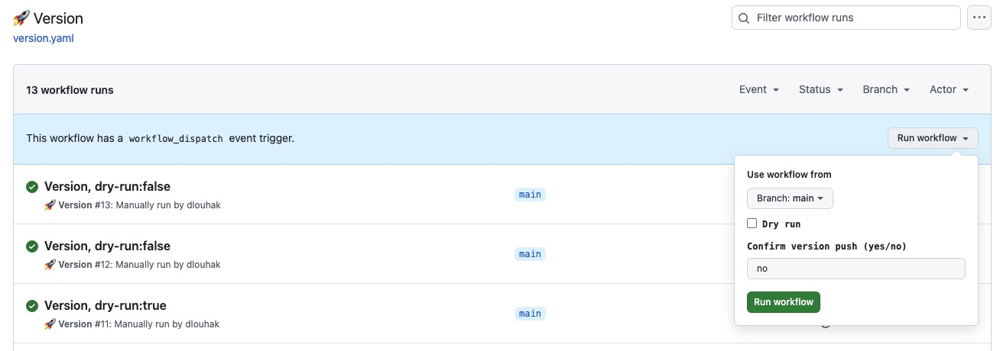

# Contributing to Spirit Design System

First of all, thanks for your contribution to this project! ❤️
Here are some tips how to make your contributing efforts efficient and eventually accepted & merged:

- [General Usage](#general-usage)
- [Decisions](#decisions)
- [Project Structure](#project-structure)
- [Development](#development)
- [Commit Conventions](#commit-conventions)
- [Code Style](#code-style)
- [Documenting the Components](#documenting-the-components)
- [Figma Code Connect](#figma-code-connect)
- [Testing](#testing)
- [Publishing](#publishing)

## General Usage

This project uses `makefile` for managing various chores, like dependency installation, testing, linting etc. Make sure you run `make` right after you clone the repository - it will set you up with everything needed to get started. Once you are done with that, have a look at what commands (targets) are available for you to run using `make` - `make install` etc.

## Decisions

The reasoning behind various [decisions][decisions] made for the Spirit Design System. A good historical record.

## Project Structure

This project is a monorepo managed by [Lerna][lerna-home]. This means that each folder inside the [packages/][packages] directory represents a package published to npm. The root directory also contains _package.json_ file but this is only used for local development purposes and does not represent something that is ever published to npm (you might notice that it only contains _devDependencies_ and no prod dependencies 🤷‍♂️).

## Development

See [Developer Handbook][developer-handbook] for more information about development.

## Commit Conventions

All commits you make SHOULD adhere to our commit guidelines. We use [conventional commits][conventional-commits] strategy with a slight modification of our own - [@lmc-eu/commitlint-config][commitlint-config]. This is later used during the release phase to determine how to bump the packages' version numbers based on commit history. 🚀

### Commit Message Format

We have very precise rules over how our Git commit messages MUST be formatted.
This format leads to **easier-to-read commit history**.

Each commit message consists of a **header**, a **body**, and a **footer**.

```txt
<header>
<BLANK LINE>
<body>
<BLANK LINE>
<footer>
```

The `header` is mandatory and MUST conform to the [Commit Message Header](#commit-header) format.

The `body` is optional but recommended for all commits except for those of type "Docs".
When the body is present it MUST be at least 20 characters long and MUST conform to the [Commit Message Body](#commit-body) format.

The `footer` is optional. The [Commit Message Footer](#commit-footer) format describes what the footer is used for and the structure it MUST have.

#### Commit Message Header

```txt
<type>(<scope>): <short summary>
  │       │             │
  │       │             └─⫸ Summary in present tense. Sentence case. No period at the end.
  │       │
  │       └─⫸ Commit Scope: analytics|design-tokens|icons|web|web-react|
  |                          exporter-tokens|exporter-assets|ci|repo
  │
  └─⫸ Commit Type: Feat|Fix|Perf|Revert|Docs|Style|Refactor|Test|Chore|Deps
```

The `<type>` and `<summary>` fields are mandatory, the `(<scope>)` field is optional.

##### Type

MUST be one of the following:

- **Chore**: Changes to our CI configuration files and scripts (examples: CircleCI, SauceLabs) or changes that affect the build system
- **Deps**: Changes to dependencies
- **Docs**: Documentation only changes
- **Feat**: A new feature
- **Fix**: A bug fix
- **Perf**: A code change that improves performance
- **Refactor**: A code change that neither fixes a bug nor adds a feature
- **Revert**: Reverting code changes
- **Test**: Adding missing tests or correcting existing tests
- **Style**: Changes to code style or styling of components and pages

##### Scope

The scope SHOULD be the name of the npm package affected (as perceived by the person reading the changelog generated from commit messages).

The following is the list of supported scopes:

- Apps:
  - `demo`
- Exporters:
  - `exporter-tokens`
  - `exporter-assets`
- Packages:
  - `analytics`
  - `codemods`
  - `design-tokens`
  - `icons`
  - `web`
  - `web-react`
- Repository-wide:
  - `ci`: used for changes that affect the Continuous Integration process and builds
  - `repo`: used for repository-wide changes
  - none/empty string: useful for `Test` and `Refactor` changes that are done across all packages (e.g. `Test: Add missing unit tests`) and for docs changes that are not related to a specific package (e.g. `Docs: Fix typo in the tutorial`).

##### Summary

Use the summary field to provide a succinct description of the change:

- use the imperative, present tense: "change" not "changed" nor "changes"
- use the sentence case (capitalize the first letter of the sentence)
- no dot (.) at the end

#### Commit Message Body

Just as in the summary, use the imperative, present tense: "fix" not "fixed" nor "fixes".

Explain the motivation for the change in the commit message body. This commit message SHOULD explain _why_ you are making the change.
You can include a comparison of the previous behavior with the new behavior in order to illustrate the impact of the change.

#### Commit Message Footer

The footer can contain information about breaking changes and deprecations and is also the place to reference GitHub issues, Jira tickets, and other PRs that this commit closes or is related to.

For example:

```txt
BREAKING CHANGE: <breaking change summary>
<BLANK LINE>
<breaking change description + migration instructions>
<BLANK LINE>
Fixes #<issue number>
```

The breaking change section SHOULD start with the phrase "BREAKING CHANGE: " followed by a summary of the breaking change, a blank line, and a detailed description of the breaking change that also includes migration instructions.

### Revert Commits

If the commit reverts a previous commit, it SHOULD begin with `Revert: `, followed by the header of the reverted commit.

The content of the commit message body SHOULD contain:

- information about the SHA of the commit being reverted in the following format: `This reverts commit <SHA>`,
- a clear description of the reason for reverting the commit message.

### Before Commit

Test your code before committing with `% yarn test` or `% yarn packages:test`. It will run type linting, code listing, testing, and code formatting.

## Code Style

This project uses Prettier for code formatting. You can run `make format` to format all your code before you submit your code for review.

## Documenting the Components

1. All components MUST be documented in a `README` file in the root of the component, e.g. `packages/web-react/Accordion/README.md`.
2. The documentation MUST be written in Markdown.
3. The documentation MUST contain at least a basic example usage of the component.
4. For complex components or components with subcomponents, the documentation SHOULD contain examples of individual building blocks as well as an example composition.
5. Component and subcomponent props MUST be documented in a table.
   1. The table MUST be placed in a section introduced by a headline called `API`.
   2. The table MUST contain the following columns:
      - `Name` — the name of the prop, e.g. `title`
      - `Type` — the type of the prop, e.g. `string`, `number`, `bool`, `[horizontal | vertical]`, an existing [dictionary][dictionary], etc.
      - `Default` — the default value of the prop, e.g. `null` or `—` (em-dash) if there is no default value
      - `Required` — if the prop is required `✓` or not `✕`
      - `Description` — the description of the prop, e.g. `Title of the accordion`
   3. The props MUST be sorted alphabetically by their name.

## Figma Code Connect

[Figma Code Connect][figma-code-connect] links Spirit Web React components to their Figma counterparts, showing developers the correct code to use when inspecting designs in [Figma Dev Mode][figma-dev-mode].

### Prerequisites

Before using Code Connect, you need:

1. **Figma Desktop App** - Code Connect requires the Figma desktop application (not the browser version)
2. **Access Token** - Generate a [personal access token][figma-access-token] from your Figma account settings
3. **Environment Variable** - Set your token as an environment variable:

```bash
export FIGMA_ACCESS_TOKEN=your-token-here
```

Or create a `.env` file in the `packages/web-react` directory:

```bash
FIGMA_ACCESS_TOKEN=your-token-here
```

### Configuration

Code Connect configuration is defined in `packages/web-react/figma.config.json`.

### Connected Components

You can see which components are already connected by looking for files with the suffix `.figma.tsx` in their component directory in `figma` folder.

### Creating New Connections

To connect a new component to Figma:

```bash
yarn workspace @alma-oss/spirit-web-react run figma:connect
```

This will guide you through the process of creating a new Code Connect file. Alternatively, you can create the file manually by following the pattern in existing `*.figma.tsx` files.

### Publishing to Figma

To publish Code Connect files to Figma:

```bash
# Publish all Code Connect files
yarn workspace @alma-oss/spirit-web-react run figma:publish

# Unpublish everything
yarn workspace @alma-oss/spirit-web-react run figma:unpublish
```

See Figma Docs how to unpublish single node.

### Viewing in Figma

Once published, developers can:

1. Open the Spirit UI KIT file in Figma Dev Mode
2. Select any connected component instance
3. View the corresponding React code in the "Code" tab
4. Copy the code snippet directly

### Resources

- [Figma Code Connect Documentation][figma-code-connect]
- [Connecting React Components Guide][figma-react-guide]
- [Code Connect CLI Reference][figma-cli]

## Testing

Each package contains a script called `test`.
Using this you can test the entire package and verify that all parts of the package are in good shape and all rules are met.

The testing script includes:

- linting using [ESlint][eslint]
- checking format using the [Prettier][prettier]
- checking types using the [Typescript][typescript] compiler
- running unit test using the [Jest][jest]

### Unit Testing

You can run unit testing via `test:unit` scripts.
For all available scripts see the package's `package.json` file.

### Manual Testing

For a better testing experience, we are using deploy previews on Netlify.
If your modification affects the publishable code and when you create a PR, every push then will be deployed to Netlify.
Netlify will create a deploy preview and you can test your changes there.
Netlify will also attach a link to the deploy preview to your PR so you can easily access it.

#### Readable Netlify Links

For a better UI experience when searching for the deploy preview link, you can use this [Gist with userContent.css][netlify-preview-gist].

### Visual Regression Testing

**Prerequisites:** [Docker][docker] 🐳

You can run visual regression testing via `Makefile` in the project root.
All commands will execute a Docker command that starts [Playwright][playwright] in a containerized environment.

- Use `make test-e2e` to run the tests.
- Use `make test-e2e-update` to update the snapshots.
- Use `make test-e2e-report` to generate and serve a report of visual regression testing. Find a report URL in the terminal output.

👉 Visual snapshots are generated based on the platform, so we need to use the same platform locally and on CI (GitHub Actions).

⚠️ The version number of the [Playwright][playwright] dependency must be the same in `package.json` file and in the `./bin/make/e2e.sh` to ensure that no additional [Playwright][playwright] dependencies will need to install (browsers are backed in the Docker image). See https://playwright.dev/docs/docker.

We run visual regression testing locally against our demo apps. Web and Web React packages are served using Vite.
Web Twig package is served using the Symfony app.

We have two test suites and you can find them in the `./tests/e2e` directory:

- `demo-homepages` - tests the homepages of our demo apps.
  - This test is used to verify that the demo apps are working properly and their homepages are not broken.
- `demo-components-compare` - tests components' pages of our demo apps'.
  - This test gets the list of components from the file system for each package and then it goes through each component and compares its page in all demo apps.
  - Only one screenshot is taken for each component. If you run the update command, only the last screenshot will be saved.

👉 To save time and repository size, we test only in the Chromium browser and only on the desktop viewport.

#### On CI Pipeline

In CI we use Netlify to test against.

To enable visual regression testing on CI, you need to add label `run-visual-tests` to your PR.
Then the tests will be run against the Netlify deployment on every change pushed.

When the tests fail, there will be a comment in the PR with a link to the report and a message about the failure will be raised in the Slack channel `#spirit-design-system-notifications_en`.
You can also find the report URL in the GitHub Actions run under the `Run actions/upload-artifact` section.
Look for `Artifact download URL: https://github.com/alma-oss/spirit-design-system/actions/runs/<run-id>/artifacts/<artifact-id>`.

⚠️ Currently we do not deploy the Web Twig package to any environment, so you can only test it locally.

#### Configuring Playwright Options

You can customize Playwright test execution locally by creating a `.env.local.playwright` file in the project root.
Copy the example file and adjust values as needed:

```bash
cp .env.local.playwright.example .env.local.playwright
```

Available environment variables:

| Variable     | Description                  | Default (local)    | Default (CI) |
| ------------ | ---------------------------- | ------------------ | ------------ |
| `PW_WORKERS` | Number of parallel workers   | Playwright default | `1`          |
| `PW_TIMEOUT` | Test timeout in milliseconds | `120000`           | `120000`     |
| `PW_RETRIES` | Number of retries            | `0`                | `2`          |

### Developing and Testing GitHub Actions

It can be time-consuming and painful to test GitHub Actions.
First, you have to change the GitHub Actions file locally, push your local code into the GitHub repository, and wait for the result.

To solve this issue, you can use [act][act] CLI tool to test and write the GitHub actions locally.

For more, please read the article [How to Run GitHub Actions Locally with the act CLI tool][act-article].

## Publishing

This project uses GitHub Actions to publish the packages automatically to npm.
New packages are published after the new tag is pushed to the main branch.
PR can be merged only by the appropriate group of maintainers.

### Steps to Create a New Package Version

Merge all appropriate PRs you want to publish into the appropriate branch

- branches:
  - `main` - for the latest stable version

#### Automatically

1. Go to repository **Actions** tab and select the `Version` workflow
   i. or go to the [workflow page directly][version-action]
2. On the right top corner, click on the `Run workflow` button
   i. Select the branch you want to publish from (e.g. `main`)
   ii. You can check the `Dry run` checkbox to run the workflow without publishing the packages
   iii. Confirm version push by writing `yes` in the input field (otherwise the changes will not be pushed)
   iv. Click on the `Run workflow` button
   
3. Check that the version number is correct and everything looks good during the workflow run or try the dry run first
4. Publishing is done automatically (event driven) by [`Publish` Action][publish-action] (uses `build` script and `make publish` command)

#### Manually (Fallback Option)

1. Run `make pristine` and `make install` to ensure that your local copy is clean and up to date
2. Run the `make version` command to bump the version number in packages (a new version number is determined automatically based on commit history)
3. Check that the version number is correct and everything looks good
4. Run `make build` to build the packages
5. Run `make publish` to publish the packages to npm (you will be prompted to enter your npm credentials or confirmation code)
6. Push changes and tags to repository
   6a. Run manually `git push && git push --tags` to push the changes to the remote
   6b. or use `git push --follow-tags` to push the changes and tags at once (works only when tags are annotated).

Both manual and automatic workflows are interchangeable.
If something went wrong you can always go step-by-step through the manual process.
Both workflows are using the same scripts and commands.

### Release Notes

Fill in a [template in Slack Canvases][release-notes-template] for the Spirit Release Notes.

Use the relevant messages from the `#spirit-design-system-notifications_en` Slack
channel that are sent to this channel after the automated publish is done.

1. On the left panel of the Slack App there are Canvases. Click on them.
2. On the right top corner, there should be a green "+ New" button. Click on it.
3. Use option "Start from a Template"
4. Find "Spirit Design System Release Notes"
5. And then click "Use template"
6. And you should be ready to prepare a new release notes.

Then share the link to the release notes in the `#spirit-design-system-team_cs_en` Slack channel to get reviews and feedback.

After the release notes are ready, you can publish them (copy&paste from canvas) to the `#spirit-design-system-announcements_cs_en` Slack channel.

> If you have further questions do not hesitate to open an issue and ask us! ❤️

[act]: https://github.com/nektos/act
[act-article]: https://www.freecodecamp.org/news/how-to-run-github-actions-locally/
[conventional-commits]: https://www.conventionalcommits.org
[commitlint-config]: https://github.com/lmc-eu/code-quality-tools/tree/main/packages/commitlint-config
[decisions]: https://github.com/alma-oss/spirit-design-system/blob/main/docs/decisions/README.md
[developer-handbook]: https://github.com/alma-oss/spirit-design-system/tree/main/docs/contribution/development.md
[dictionary]: https://github.com/alma-oss/spirit-design-system/tree/main/docs/DICTIONARIES.md
[docker]: https://www.docker.com/
[eslint]: https://eslint.org/
[jest]: https://jestjs.io/
[lerna-home]: https://lerna.js.org
[netlify-preview-gist]: https://gist.github.com/adamkudrna/694f3048c1338f07375b9b8af24afe2f
[packages]: packages/
[playwright]: https://playwright.dev/
[prettier]: https://prettier.io/
[publish-action]: https://github.com/alma-oss/spirit-design-system/actions/workflows/publish.yaml
[release-notes-template]: https://almamedia.slack.com/docs/T0325RBAD/F08D6U6EAKH
[typescript]: https://www.typescriptlang.org/
[figma-access-token]: https://help.figma.com/hc/en-us/articles/8085703771159-Manage-personal-access-tokens
[figma-cli]: https://github.com/figma/code-connect
[figma-code-connect]: https://developers.figma.com/docs/code-connect/
[figma-dev-mode]: https://help.figma.com/hc/en-us/articles/15023124644247-Guide-to-Dev-Mode
[figma-react-guide]: https://developers.figma.com/docs/code-connect/react/
[version-action]: https://github.com/alma-oss/spirit-design-system/actions/workflows/version.yaml
