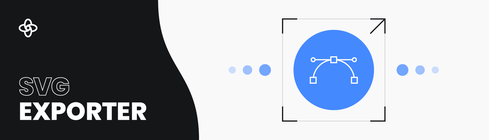

[Supernova](https://supernova.io) is a design system platform that manages your assets, tokens, components and allows you to write spectacular documentations for your entire teams. And because you found your way here, you are probably interested in its most advanced functionality - automatic hand-off of design and development assets, tokens and data in general. To learn everything Supernova, please check out our [developer documentation](https://developers.supernova.io/).


# SVG Asset Exporter

The SVG Asset exporter allows you to **export a list of images** in such a way that it can be immediately used in your production codebase. This specific exporter exports assets in generic fashion, as SVG format, without any additional formatting or generated support files.

### Exporter Output

This exporter will render image assets defined inside one specific brand and will produce the following structure:

```
/icons
   /top_menu
      |- burger.svg
      |- user.svg
```

### Naming

The names of icons will be constructed from the original name and path built from segments which correspond to groups the Supernova (and Figma) groups. For example:

```
Icons
  |- Top Menu
     |- burger
     |- user
```

Names follow `icon-name` convention and will create separate directories for each group detected, also following `directory-name` convention. The above example will be converted to the following icon paths:

```
/icons/top-menu/burger.svg
/icons/top-menu/user.svg
```

This behavior can be fully customized by simply modifying the path generation template file `asset_path.pr`. Simply fork, modify and upload as your version of the exporter. If you have never done this before, [follow our guide to modifying existing exporters](https://developers.supernova.io/building-exporters/cloning-exporters).

## Installing

In order to make the Supernova SVG Asset exporter available for your organization so you can start generating code from your design system, please follow the installation guide in our [developer documentation](https://developers.supernova.io/using-exporters/installing-exporters).


## Reporting Bugs or Requesting Features

In order to faciliate easy communication and speed up delivery of fixes and features for this exporter, we require everyone to log all issues and feature requests through the issue tracking of this repository.

Please read through the [existing issues](../../issues) before you open a new issue! It might be that we have already discussed it before. If you are sure your request wasn't mentioned just yet, proceed to [open a new issue](../../issues) and fill in the required information. Thank you!


## Contributing

If you have an idea for improving this exporter package or want a specific issue fixed quickly, we would love to see you contribute to its development!

There are multiple ways you can contribute, so we have written a [contribution guide](https://developers.supernova.io/building-exporters/contribution-and-requests) that will walk your through the process. Any pull requests to this repository are very welcome.

## License

This exporter is distributed under the [MIT license](./LICENSE.md). [We absolutely encourage you](https://developers.supernova.io/building-exporters/cloning-exporters) to clone it and modify it for your purposes, so it fits the requirements of your stack. If you see that you have created something amazing in the process that others would benefit from, we strongly recommend you consider [publishing it back to the community](https://developers.supernova.io/building-exporters/sharing-exporters-with-others) as well.

## Useful Links

- To learn more about Supernova, [go visit our website](https://supernova.io)
- To join our community of fellow developers where we try to push what is possible with design systems and code automation, join our [community discord](https://community.supernova.io)
- To understand everything you can do with Supernova and how much time and resources it can save you, go read our [product documentation](https://learn.supernova.io/)
- Finally, to learn everything about what exporters are and how you can integrate with your codebase, go read our [developer documentation](https://developers.supernova.io/)

## Other Supernova Exporters

We are developing and maintaining exporters for many major technologies. Here are all the official exporters maintained by Supernova:

- [iOS Exporter](https://github.com/Supernova-Studio/exporter-ios)
- [iOS Localization Exporter](https://github.com/Supernova-Studio/exporter-ios-localization)
- [Android Exporter](https://github.com/Supernova-Studio/exporter-android)
- [React Exporter](https://github.com/Supernova-Studio/exporter-react)
- [Flutter Exporter](https://github.com/Supernova-Studio/exporter-flutter)
- [Angular Exporter](https://github.com/Supernova-Studio/exporter-angular)
- [Typescript Exporter](https://github.com/Supernova-Studio/exporter-typescript)
- [CSS Exporter](https://github.com/Supernova-Studio/exporter-css)
- [LESS Exporter](https://github.com/Supernova-Studio/exporter-less)
- [SCSS Exporter](https://github.com/Supernova-Studio/exporter-scss)


Additionally, we are also developing and maintaining exporters for specific use cases:

- [Style Dictionary Exporter](https://github.com/Supernova-Studio/exporter-style-dictionary)
- [HTML Preview Exporter](https://github.com/Supernova-Studio/exporter-html-preview)

To browse all exporters created by our amazing community, please visit the [Supernova](https://supernova.io) Exporter Store.
